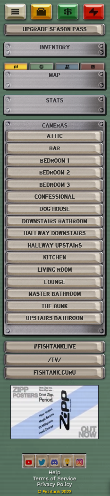

# fishtank-s02

Adds some quality of life features for [Fishtank season 2](https://www.fishtank.live/) site that I wanted.

## Features

- List of all cameras on left panel
- Button in left panel to open `#fishtanklive` on X in new tab

## Install

Install with TamperMonkey, GreaseMonkey, or similar userscript browser add-on

## Note

I couldn't figure out how to interact directly with the webpacked app that Fishtank uses.
So, I went for a little hacky approach of auto-clicking, so there's an extra sound that plays when swapping cameras.
